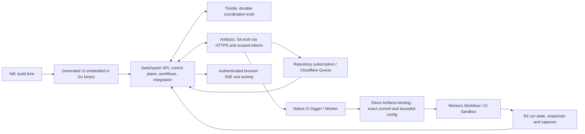

# Switchyard — consolidated architecture handover

The primary architecture document. Another capable agent should be able to read
this and understand the design without the chat history. It deliberately
distinguishes proven facts, current decisions, working hypotheses, experimental
gates, deferred choices, and separate upstream work.

## Current implementation, October 4 2026

The two event paths are parallel fan-out, not a Worker-to-Queue relay. Go polls
signed exact-SHA Worker manifests into Actions and required-check state. Nift,
Node, templates, public asset directories and Strut are build-time or historical
artifacts, not separately deployed Switchyard runtime components. External Git,
Trestle, Cloudflare services and host system libraries remain permitted dependencies.
The release serves embedded UI unless an explicit development static override is set.

CodeMirror 6 and the Gantry explorer are implemented editor dependencies; Save
and Commit remain separate. Browser SSE is served by Go. A Worker/Durable Object
SSE bridge is a historical proposal, not the current deployed path. Git transport
is HTTPS; native Artifacts SSH is unavailable and a gateway is deferred. Generic
Workflow CI is certified; Builds/Worker Preview needs legitimate scoped setup.

The application entry point still selects DeterministicRunner. CLIRunner is an
isolated library boundary, not a certified production provider. Genuine external
Agent selection, authorized credential resolution, production wiring and bounded
concurrency remain open. Do not treat the deterministic two-Attempt fixture as
concurrent external Agents. C36 independently proves ordinary push → automatic CI,
Queue/ref observation, SSE, deduplication and reconciliation. See the
[campaign ledger](../plan/codex-implementation-campaign.md) and
[C36 evidence](../evidence/campaign/C36/README.md).

## 1. Historical proven facts (validated in Checkpoint 0)

- **Cloudflare Artifacts behaves as faithful Git truth**: repo create/import/fork,
  scoped tokens, ordinary `git clone/commit/push`, REST reads (log/commit/tree/
  blob/file/raw), and structured push events all worked live.
  [`checkpoint-0/cloudflare-artifacts/`](../checkpoint-0/cloudflare-artifacts/README.md)
- **Event → queue → Trestle ingest with idempotent redelivery works**: a `pushed`
  event was delivered via a Queues event subscription, normalized, ingested into
  single-node Trestle, and re-delivery with an `Idempotency-Key` produced exactly
  one record.
- **Single-node Trestle emits events/audit on writes** (verified: events=1,
  audit=1); **clustered/Raft mode emits none** (reproduced defect — see §7).
- **Strut current main implements the step-executor surface** Switchyard needs:
  16/16 ctest, 11/11 relevant certification scripts, 11/11 probes (HTTPS, SSE,
  JSON, processes/pipes, git CLI, concurrency, filesystem, crypto, cancellation,
  child-failure recovery, graceful shutdown).
  [`checkpoint-0/strut-surface-validation/`](../checkpoint-0/strut-surface-validation/README.md)
- **Warden inspection**: Warden already has the tree+editor+hideable-agent layout
  and an OpenCode-CLI agent executor; `gantry-core/editor` (deterministic server
  edit primitive) and `gantry-core/agent` (run-state classification) are the
  reusable lower-level pieces. Warden's browser UI is application-specific and
  should not be transplanted.

## 2. Current architecture decisions (settled enough to build around)

- **Authority split**: Artifacts = Git truth; Trestle = coordination truth;
  Go adapters = deterministic/bounded local execution; Workers/Workflows/CI
  Sandbox = repository CI; R2 = snapshots/captures; Nift = web/docs build layer
  ([`docs/README.md`](../README.md)).
- **Domain model**: Work, Attempt, Pull Request; Issue is a Work subtype; Review
  (familiar) containing structured Review Findings; distinct conflict categories;
  pragmatic provenance. See [`domain-model.md`](domain-model.md).
- **Git/ref model**: per-ref **CAS mutation primitive** (`UpdateRef(repo, ref,
  expected_sha, new_sha, provenance)`), higher-level **Integration Queue** for
  canonical scheduling, and an independent **execution queue** for agent/workflow
  work. Direct human Git remains first-class. See
  [`git-and-ref-model.md`](git-and-ref-model.md).
- **Agents**: Role / Provider Profile / Principal / Execution / Worker/Executor
  are distinct; runner execution is pluggable behind one substrate; workflows and
  hooks reference **roles, never secrets**. See
  [`agents-and-workflows.md`](agents-and-workflows.md).
- **Security**: credentials (BYOK) separate from Switchyard capabilities;
  SecretStore contract with plaintext only in the execution-resolution path. See
  [`security-and-credentials.md`](security-and-credentials.md).
- **Editor**: persistent browser editor, Save ≠ Commit, recoverable transient
  draft state, shared diff surface, hideable Agent panel, no terminal. See
  [`editor.md`](editor.md).
- **Realtime**: authenticated browser SSE is served by Go from durable
  coordination events. The Worker/Durable-Object bridge is historical. See [`realtime.md`](realtime.md).
- **Product/UX**: GitHub-like familiarity in the simple case, agent-native
  capability revealed progressively; dark-first, site-wide title `Switchyard`,
  favicon, full-screen mobile hamburger menu. See
  [`../product/`](../product/ux-principles.md).

## 3. Working hypotheses (strong current choices, may change with evidence)

- Draft storage = content-addressed blobs + a small Trestle manifest (vs other
  models); draft concurrency = per-file optimistic three-way merge, no
  last-writer-wins. **Requires the draft experiments (E2/E3).**
- `UpdateRef` CAS semantics are obtainable through Artifacts' Git protocol
  (Git's expected-old ref behaviour) — **must be verified under contention (E1)**.
- CodeMirror 6 is implemented and certified for the C20 shortcut/selection surface.
- Work is auto-created (implicit) when an Agent is asked to do something without
  one — exact auto-creation heuristics are a Codex-review thread (T3/T4-adjacent).
- The first Agent vertical slice uses one runner adapter (coding-agent CLI),
  not a provider-API adapter.

## 4. Experimental gates (must be proven before depending on them)

See [`../plan/verification.md`](../plan/verification.md) for the full checklist:

- **E1 — Artifacts per-ref contention/CAS**: does a stale, non-force push reject
  cleanly, and does the Git protocol expose expected-old semantics as needed?
- **E2 — Draft recovery/sync**: measure real latency; confirm "bounded recent-edit
  loss" under reload/crash; confirm multi-device.
- **E3 — three-way merge for human/Agent stale edits**: correct deterministic
  merge vs surfacing contention.
- **E4 — secret resolution → executor path**: latency, expiry, child-inheritance
  enforcement, no leakage to logs/provenance.

## 5. Deferred implementation choices

- Draft blob storage backend (R2 vs an Artifacts blob namespace) and TTL/GC.
- Concrete SecretStore backend (app-encrypted ciphertext vs cloud facility).
- CodeMirror extension/diff-gutter composition; mobile editor pane details.
- Findings-in-editor gutter mechanics; per-file vs per-hunk revert.
- Agent role configuration syntax and exact precedence.
- GitHub/GitLab interop depth.

## 6. Separate upstream / project work (do NOT fix inside Switchyard)

See [`../plan/dependencies.md`](../plan/dependencies.md):

- **Trestle**: clustered side-effect bug (events/audit/outbox absent on Raft
  writes); cluster-identity ergonomics (raft ServerID must equal the Gantry
  node_id); candidate user-facing realtime (not blocking — Go serves browser SSE).
- **Strut**: historical CP0 executor validation, not an active release gate or
  runtime dependency. Current deterministic execution is Go.
- **Nift**: consume released Nift capabilities; no ad-hoc modification.
- **Cloudflare**: operational notes (Workers Paid requirement, `cf` CLI gaps in
  event-subscription enums and http-pull enablement); the October 2026 announcement states Artifacts billing begins 2026-10-15.
- **Warden / gantry-core**: consume `gantry-core/editor` and `gantry-core/agent`;
  adapt Warden's explorer/editor interaction model without an interactive
  terminal, as requested for C20; preserve dependency/license attribution.

## 7. Known critical upstream defect (context)

Checkpoint 0 reproduced on a real 3-process Raft cluster that **clustered Trestle
record writes replicate the records but produce zero events, audit facts, or
outbox jobs** — on any node, via leader or follower. This gates **clustered**
Switchyard, not the single-node foundation. Full reproduction:
[`checkpoint-0/trestle-clustering-repro/`](../checkpoint-0/trestle-clustering-repro/README.md).

## 8. Where this leads

The implementation gameplan is in [`../plan/checkpoints.md`](../plan/checkpoints.md).
CP0/CP1 documents above retain their historical experiment context; the active
implementation campaign has advanced through C34–C43 with explicitly open gates.
Current implementation and limits are recorded in [the campaign ledger](../plan/codex-implementation-campaign.md); [Cloudflare Actions](cloudflare-actions.md) documents the native CI execution path.
